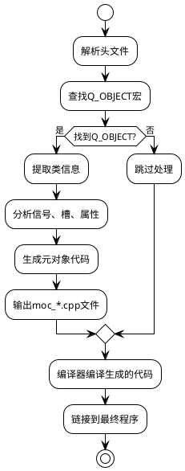
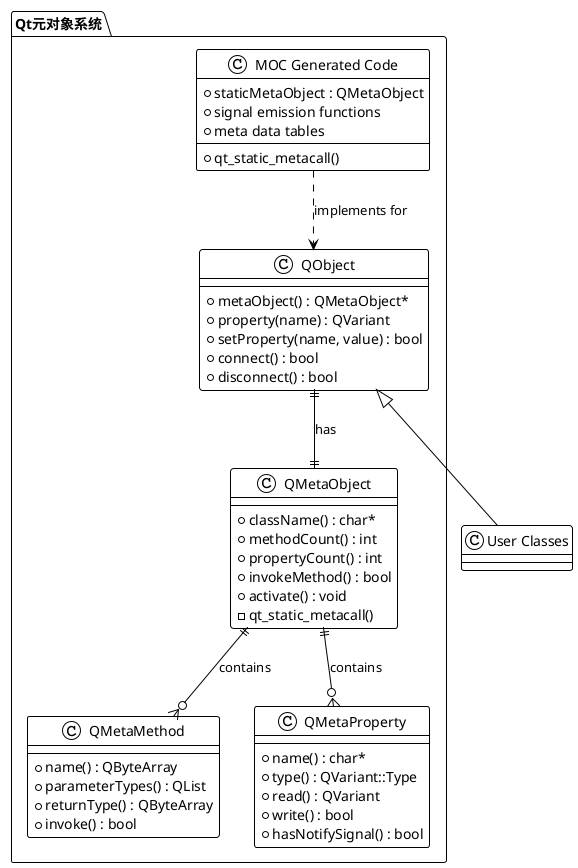
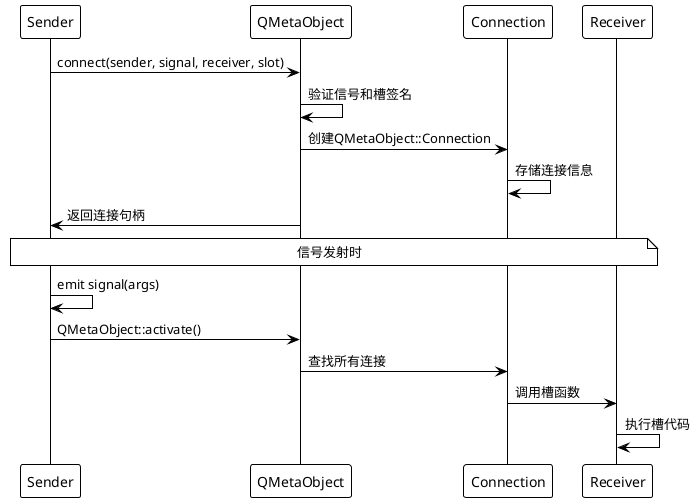

# Qt6 元对象系统深度解析

## 目录
1. [概述](#概述)
2. [核心概念](#核心概念)
3. [关键宏定义深度解析](#关键宏定义深度解析)
4. [QObject基础示例](#qobject基础示例)
5. [MOC编译过程详解](#moc编译过程详解)
6. [元对象系统架构](#元对象系统架构)
7. [信号槽机制深入](#信号槽机制深入)
8. [Connect函数实现原理](#connect函数实现原理)
9. [属性系统](#属性系统)
10. [反射与内省](#反射与内省)
11. [实际应用场景](#实际应用场景)
12. [Demo项目技术点分析](#demo项目技术点分析)
13. [性能考量](#性能考量)
14. [最佳实践](#最佳实践)

## 概述

Qt的元对象系统（Meta-Object System）是Qt框架的核心基础设施，它为C++语言添加了运行时类型信息、反射能力和动态属性系统。这个系统使得Qt能够提供信号槽机制、属性系统、对象内省等高级特性。

### 为什么需要元对象系统？

C++作为静态类型语言，缺乏运行时类型信息和反射能力。Qt通过元对象系统弥补了这些不足：

- **运行时类型识别**：能够在运行时获取对象的类型信息
- **动态方法调用**：可以通过字符串名称调用方法
- **信号槽机制**：类型安全的观察者模式实现
- **属性系统**：动态属性的读写和监听
- **对象序列化**：自动化的对象持久化

## 核心概念

### QObject - 根基类

所有需要元对象功能的类都必须继承自`QObject`：

```cpp
class QObject {
    Q_OBJECT  // 元对象宏，触发MOC处理
public:
    // 基础功能
    virtual const QMetaObject *metaObject() const;
    static const QMetaObject staticMetaObject;
    
    // 对象树管理
    QObject *parent() const;
    void setParent(QObject *parent);
    QObjectList children() const;
    
    // 属性系统
    QVariant property(const char *name) const;
    bool setProperty(const char *name, const QVariant &value);
    
    // 信号槽
    bool connect(const QObject *sender, const char *signal,
                const QObject *receiver, const char *slot);
};
```

### QMetaObject - 元对象描述符

每个QObject子类都有一个对应的`QMetaObject`实例，包含类的完整元信息：

```cpp
class QMetaObject {
public:
    // 类信息
    const char *className() const;
    const QMetaObject *superClass() const;
    
    // 方法信息
    int methodCount() const;
    QMetaMethod method(int index) const;
    int indexOfMethod(const char *method) const;
    
    // 属性信息
    int propertyCount() const;
    QMetaProperty property(int index) const;
    int indexOfProperty(const char *name) const;
    
    // 动态调用
    bool invokeMethod(QObject *obj, const char *member,
                     QGenericReturnArgument ret,
                     QGenericArgument val0 = QGenericArgument()) const;
};
```

## 关键宏定义深度解析

Qt元对象系统的核心功能通过一系列宏定义实现。理解这些宏的工作原理对于深入掌握Qt至关重要。

### Q_OBJECT 宏

`Q_OBJECT`是元对象系统的入口宏，必须放在类声明的开头。

#### 宏定义分析
```cpp
// qobjectdefs.h中的简化定义
#define Q_OBJECT \
public: \
    QT_WARNING_PUSH \
    Q_OBJECT_NO_OVERRIDE_WARNING \
    static const QMetaObject staticMetaObject; \
    virtual const QMetaObject *metaObject() const; \
    virtual void *qt_metacast(const char *); \
    virtual int qt_metacall(QMetaObject::Call, int, void **); \
    QT_TR_FUNCTIONS \
private: \
    Q_OBJECT_NO_ATTRIBUTES_WARNING \
    Q_DECL_HIDDEN_STATIC_METACALL static void qt_static_metacall(QObject *, QMetaObject::Call, int, void **); \
    QT_WARNING_POP \
    struct QPrivateSignal {}; \
    QT_ANNOTATE_CLASS(qt_qobject, "")
```

#### 功能解析
1. **声明静态元对象**：`static const QMetaObject staticMetaObject`
2. **虚函数声明**：提供元对象访问接口
3. **类型转换支持**：`qt_metacast`实现安全的向下转型
4. **元调用接口**：`qt_metacall`统一的方法调用入口
5. **静态元调用**：`qt_static_metacall`高效的方法分发
6. **私有信号类型**：`QPrivateSignal`确保信号只能在类内部发射

#### 为什么必须使用Q_OBJECT？
```cpp
// 没有Q_OBJECT的类
class SimpleClass : public QObject {
    // 缺少元对象支持，无法使用：
    // - 信号槽
    // - 属性系统  
    // - 反射调用
    // - qobject_cast
};

// 有Q_OBJECT的类
class MetaClass : public QObject {
    Q_OBJECT  // MOC会为此类生成完整的元对象代码
    // 可以使用所有元对象特性
};
```

### Q_PROPERTY 宏

`Q_PROPERTY`用于声明类的属性，支持读写访问、变更通知等功能。

#### 宏语法
```cpp
Q_PROPERTY(type name 
           READ getter 
           [WRITE setter] 
           [RESET resetter] 
           [NOTIFY notifySignal] 
           [REVISION int] 
           [DESIGNABLE bool] 
           [SCRIPTABLE bool] 
           [STORED bool] 
           [USER bool] 
           [CONSTANT] 
           [FINAL])
```

#### 属性特性详解
```cpp
class PropertyDemo : public QObject {
    Q_OBJECT
    
    // 基本读写属性
    Q_PROPERTY(QString name READ name WRITE setName NOTIFY nameChanged)
    
    // 只读属性
    Q_PROPERTY(int id READ id CONSTANT)
    
    // 可重置属性
    Q_PROPERTY(QColor color READ color WRITE setColor RESET resetColor)
    
    // 计算属性（不存储）
    Q_PROPERTY(QString displayName READ displayName STORED false)
    
    // 设计器属性（Qt Designer中可见）
    Q_PROPERTY(bool visible READ isVisible WRITE setVisible DESIGNABLE true)
    
    // 用户属性（主要属性，用于数据绑定）
    Q_PROPERTY(QString text READ text WRITE setText USER true)

public:
    QString name() const { return m_name; }
    void setName(const QString &name) {
        if (m_name != name) {
            m_name = name;
            emit nameChanged(name);  // 发射通知信号
        }
    }
    
    int id() const { return m_id; }  // 只读，无setter
    
    QColor color() const { return m_color; }
    void setColor(const QColor &color) { m_color = color; }
    void resetColor() { m_color = Qt::white; }  // 重置功能
    
    QString displayName() const {
        return QString("%1 (ID: %2)").arg(m_name).arg(m_id);  // 计算属性
    }

signals:
    void nameChanged(const QString &name);

private:
    QString m_name;
    int m_id = 0;
    QColor m_color = Qt::white;
};
```

#### MOC如何处理Q_PROPERTY
MOC解析Q_PROPERTY声明后，会在元数据表中生成属性信息：
```cpp
// MOC生成的属性数据（简化）
static const uint qt_meta_data_PropertyDemo[] = {
    // 属性表
    // name属性: 名称索引, 类型, 标志位
    0, QMetaType::QString, 0x00495103,  // READ|WRITE|NOTIFY
    1, QMetaType::Int,     0x00015401,  // READ|CONSTANT  
    2, QMetaType::QColor,  0x00495107,  // READ|WRITE|RESET
    3, QMetaType::QString, 0x00095001,  // READ|STORED=false
};
```

### Q_INVOKABLE 宏

`Q_INVOKABLE`标记方法可以通过元对象系统调用。

#### 宏定义
```cpp
// qobjectdefs.h
#define Q_INVOKABLE
```

看起来`Q_INVOKABLE`是个空宏？实际上它是MOC的标记！

#### 工作原理
```cpp
class InvokableDemo : public QObject {
    Q_OBJECT
    
public:
    // 普通方法 - 无法通过QMetaObject::invokeMethod调用
    void normalMethod() { qDebug() << "Normal method"; }
    
    // Q_INVOKABLE方法 - 可以通过反射调用
    Q_INVOKABLE void invokableMethod() { qDebug() << "Invokable method"; }
    Q_INVOKABLE QString getInfo() const { return "Info"; }
    Q_INVOKABLE void processData(const QString &data, int count) {
        qDebug() << "Processing:" << data << "count:" << count;
    }

public slots:
    // 槽函数天然可调用（无需Q_INVOKABLE）
    void slotMethod() { qDebug() << "Slot method"; }
};
```

#### 为什么Q_INVOKABLE方法可以反射调用？
MOC扫描源码时，会将标记为`Q_INVOKABLE`的方法记录在元数据中：

```cpp
// MOC生成的方法表（简化）
static const uint qt_meta_data_InvokableDemo[] = {
    // 方法表
    // invokableMethod(): 名称索引, 参数数量, 参数表索引, 标签, 标志, 元类型偏移
    1, 0, 14, 2, 0x02, 6,  // 0x02 = Method标志
    2, 0, 15, 2, 0x02, 7,  // getInfo()
    3, 2, 16, 2, 0x02, 8,  // processData(QString,int)
    4, 0, 21, 2, 0x0a, 11, // slotMethod() - 0x0a = Slot标志
};
```

#### 反射调用示例
```cpp
void testInvocation() {
    InvokableDemo *obj = new InvokableDemo;
    
    // 成功 - Q_INVOKABLE方法
    bool success1 = QMetaObject::invokeMethod(obj, "invokableMethod");
    qDebug() << "Invoke invokableMethod:" << success1;  // true
    
    // 成功 - 槽函数
    bool success2 = QMetaObject::invokeMethod(obj, "slotMethod");
    qDebug() << "Invoke slotMethod:" << success2;  // true
    
    // 失败 - 普通方法
    bool success3 = QMetaObject::invokeMethod(obj, "normalMethod");
    qDebug() << "Invoke normalMethod:" << success3;  // false
    
    // 带参数和返回值的调用
    QString result;
    bool success4 = QMetaObject::invokeMethod(obj, "getInfo", 
                                             Q_RETURN_ARG(QString, result));
    qDebug() << "Result:" << result;  // "Info"
    
    // 带多个参数的调用
    bool success5 = QMetaObject::invokeMethod(obj, "processData",
                                             Q_ARG(QString, "test data"),
                                             Q_ARG(int, 42));
}
```

### Q_EMIT 宏

`Q_EMIT`用于发射信号，实际上是`emit`关键字的别名。

#### 宏定义
```cpp
// qobjectdefs.h
#ifndef QT_NO_EMIT
# define emit
#endif
#ifndef QT_NO_KEYWORDS
# define Q_EMIT emit
#endif
```

#### 使用示例
```cpp
class SignalDemo : public QObject {
    Q_OBJECT
    
public:
    void triggerSignal() {
        // 三种等价的信号发射方式
        emit dataChanged("new data");     // 标准方式
        Q_EMIT dataChanged("new data");   // 显式宏方式  
        dataChanged("new data");          // 直接调用（不推荐）
    }

signals:
    void dataChanged(const QString &data);
};
```

#### emit的工作原理
`emit`实际上是空的！信号发射的真正工作由MOC生成的信号函数完成：

```cpp
// MOC为dataChanged信号生成的函数
void SignalDemo::dataChanged(const QString &_t1) {
    void *_a[] = { nullptr, const_cast<void*>(reinterpret_cast<const void*>(&_t1)) };
    QMetaObject::activate(this, &staticMetaObject, 0, _a);
}
```

当你写`emit dataChanged("test")`时，实际调用的是上面这个MOC生成的函数。

### Q_ENUM 和 Q_FLAG 宏

用于将枚举类型注册到元对象系统。

#### 基本用法
```cpp
class EnumDemo : public QObject {
    Q_OBJECT
    
public:
    enum Priority {
        Low,
        Normal, 
        High,
        Critical
    };
    Q_ENUM(Priority)  // 注册枚举到元对象系统
    
    enum Option {
        None = 0x0,
        ReadOnly = 0x1,
        WriteOnly = 0x2,
        ReadWrite = ReadOnly | WriteOnly,
        Executable = 0x4
    };
    Q_DECLARE_FLAGS(Options, Option)
    Q_FLAG(Options)  // 注册标志枚举
    
    Q_PROPERTY(Priority priority READ priority WRITE setPriority)
    Q_PROPERTY(Options options READ options WRITE setOptions)

public:
    Priority priority() const { return m_priority; }
    void setPriority(Priority p) { m_priority = p; }
    
    Options options() const { return m_options; }
    void setOptions(Options opts) { m_options = opts; }

private:
    Priority m_priority = Normal;
    Options m_options = None;
};

Q_DECLARE_OPERATORS_FOR_FLAGS(EnumDemo::Options)
```

#### 枚举的元对象功能
```cpp
void testEnumMetaObject() {
    const QMetaObject *metaObj = &EnumDemo::staticMetaObject;
    
    // 获取枚举信息
    QMetaEnum priorityEnum = metaObj->enumerator(
        metaObj->indexOfEnumerator("Priority"));
    
    qDebug() << "Enum name:" << priorityEnum.name();
    qDebug() << "Key count:" << priorityEnum.keyCount();
    
    // 枚举值与字符串转换
    for (int i = 0; i < priorityEnum.keyCount(); ++i) {
        qDebug() << "Key:" << priorityEnum.key(i) 
                 << "Value:" << priorityEnum.value(i);
    }
    
    // 字符串到枚举值
    int value = priorityEnum.keyToValue("High");  // 返回2
    
    // 枚举值到字符串
    const char* key = priorityEnum.valueToKey(2);  // 返回"High"
    
    // 在属性系统中使用
    EnumDemo *obj = new EnumDemo;
    obj->setProperty("priority", "Critical");  // 字符串设置枚举
    
    QVariant priorityVar = obj->property("priority");
    qDebug() << "Priority value:" << priorityVar.toInt();  // 3
}
```

### 宏定义总结

| 宏名称 | 作用 | MOC处理 | 使用场景 |
|--------|------|---------|----------|
| Q_OBJECT | 启用元对象功能 | 生成完整元对象代码 | 所有需要元对象功能的类 |
| Q_PROPERTY | 声明属性 | 生成属性元数据 | 需要统一属性访问的场景 |
| Q_INVOKABLE | 标记可调用方法 | 记录到方法表 | 需要反射调用的方法 |
| Q_EMIT/emit | 发射信号 | 空宏，调用MOC生成的函数 | 信号发射 |
| Q_ENUM | 注册枚举 | 生成枚举元数据 | 需要字符串转换的枚举 |
| Q_FLAG | 注册标志枚举 | 生成标志元数据 | 位标志操作 |

理解这些宏的工作原理，有助于：
1. **正确使用元对象功能**：知道什么时候需要什么宏
2. **调试元对象问题**：理解MOC的处理过程
3. **优化性能**：了解各种调用方式的开销
4. **扩展Qt功能**：基于元对象系统开发自定义功能

## QObject基础示例

让我们创建一个完整的示例来演示元对象系统的使用：

```cpp
// person.h
#ifndef PERSON_H
#define PERSON_H

#include <QObject>
#include <QString>
#include <QDebug>

class Person : public QObject
{
    Q_OBJECT
    
    // 属性声明
    Q_PROPERTY(QString name READ name WRITE setName NOTIFY nameChanged)
    Q_PROPERTY(int age READ age WRITE setAge NOTIFY ageChanged)
    Q_PROPERTY(bool isAdult READ isAdult STORED false)  // 计算属性，不存储
    
public:
    explicit Person(QObject *parent = nullptr);
    Person(const QString &name, int age, QObject *parent = nullptr);
    
    // 属性访问器
    QString name() const { return m_name; }
    void setName(const QString &name);
    
    int age() const { return m_age; }
    void setAge(int age);
    
    bool isAdult() const { return m_age >= 18; }
    
    // 可调用方法
    Q_INVOKABLE void introduce() const;
    Q_INVOKABLE QString getInfo() const;
    Q_INVOKABLE void celebrateBirthday();

public slots:
    void onNameChanged(const QString &newName);
    void reset();

signals:
    void nameChanged(const QString &newName);
    void ageChanged(int newAge);
    void birthdayCelebrated(int newAge);

private:
    QString m_name;
    int m_age;
};

#endif // PERSON_H
```

```cpp
// person.cpp
#include "person.h"

Person::Person(QObject *parent)
    : QObject(parent), m_name("Unknown"), m_age(0)
{
    // 连接信号槽
    connect(this, &Person::nameChanged, this, &Person::onNameChanged);
}

Person::Person(const QString &name, int age, QObject *parent)
    : QObject(parent), m_name(name), m_age(age)
{
    connect(this, &Person::nameChanged, this, &Person::onNameChanged);
}

void Person::setName(const QString &name)
{
    if (m_name != name) {
        m_name = name;
        emit nameChanged(name);
    }
}

void Person::setAge(int age)
{
    if (m_age != age && age >= 0) {
        m_age = age;
        emit ageChanged(age);
    }
}

void Person::introduce() const
{
    qDebug() << QString("Hello, I'm %1, %2 years old").arg(m_name).arg(m_age);
}

QString Person::getInfo() const
{
    return QString("Name: %1, Age: %2, Adult: %3")
           .arg(m_name)
           .arg(m_age)
           .arg(isAdult() ? "Yes" : "No");
}

void Person::celebrateBirthday()
{
    setAge(m_age + 1);
    qDebug() << m_name << "is now" << m_age << "years old!";
    emit birthdayCelebrated(m_age);
}

void Person::onNameChanged(const QString &newName)
{
    qDebug() << "Name changed to:" << newName;
}

void Person::reset()
{
    setName("Unknown");
    setAge(0);
}

// MOC会生成这个文件的包含
#include "person.moc"
```

## MOC编译过程详解

Meta-Object Compiler (MOC) 是Qt的预处理器，它解析包含`Q_OBJECT`宏的头文件，生成额外的C++代码来实现元对象功能。

### MOC处理流程



### MOC生成的代码分析

当MOC处理我们的`Person`类时，会生成`moc_person.cpp`文件。让我们分析其关键部分：
#### 1. 静态元对象数据

```cpp
// moc_person.cpp (简化版本)

// 字符串表 - 存储所有元信息的字符串
static const uint qt_meta_data_Person[] = {
    // 版本信息
    10,       // revision
    0,        // classname
    0, 0,     // classinfo
    6, 14,    // methods (6个方法，从索引14开始)
    3, 44,    // properties (3个属性，从索引44开始)
    0, 0,     // enums/sets
    0, 0,     // constructors
    0,        // flags
    3,        // signalCount (3个信号)

    // 方法表 (信号 + 槽 + 可调用方法)
    // 信号: nameChanged(QString)
    1, 0x06, 0x80000000 | 2, 3,  // 方法索引1，信号标志，返回类型，参数类型
    // 信号: ageChanged(int)  
    4, 0x06, 0x80000000 | 5, 6,
    // 信号: birthdayCelebrated(int)
    7, 0x06, 0x80000000 | 5, 6,
    // 槽: onNameChanged(QString)
    8, 0x0a, 0x80000000 | 9, 3,
    // 槽: reset()
    10, 0x0a, 0x80000000 | 9, 11,
    // 可调用: introduce()
    12, 0x02, 0x80000000 | 9, 11,

    // 属性表
    // name属性
    13, 0x80000000 | 2, 0x00495103,  // 属性名，类型，标志(READ|WRITE|NOTIFY)
    // age属性  
    14, 0x80000000 | 5, 0x00495103,
    // isAdult属性
    15, 0x01, 0x00095001,  // 只读属性
};

// 字符串数据
static const char qt_meta_stringdata_Person[] = {
    "Person\0"           // 0: 类名
    "nameChanged\0"      // 1: 信号名
    "QString\0"          // 2: 类型名
    "newName\0"          // 3: 参数名
    "ageChanged\0"       // 4
    "int\0"              // 5
    "newAge\0"           // 6
    "birthdayCelebrated\0" // 7
    "onNameChanged\0"    // 8
    "void\0"             // 9
    "reset\0"            // 10
    "\0"                 // 11: 空参数
    "introduce\0"        // 12
    "name\0"             // 13
    "age\0"              // 14
    "isAdult\0"          // 15
};
```

#### 2. QMetaObject实例

```cpp
const QMetaObject Person::staticMetaObject = {
    { &QObject::staticMetaObject,  // 父类元对象
      qt_meta_stringdata_Person,   // 字符串表
      qt_meta_data_Person,         // 数据表
      qt_static_metacall,          // 静态调用函数
      nullptr,                     // 额外数据
      nullptr                      // 不完整类型信息
    }
};

// 虚函数实现
const QMetaObject *Person::metaObject() const
{
    return QObject::d_ptr->metaObject ? 
           QObject::d_ptr->dynamicMetaObject() : 
           &staticMetaObject;
}
```

#### 3. 静态元调用函数

这是元对象系统的核心 - 统一的方法调用接口：

```cpp
void Person::qt_static_metacall(QObject *_o, QMetaObject::Call _c, 
                                int _id, void **_a)
{
    if (_c == QMetaObject::InvokeMetaMethod) {
        auto *_t = static_cast<Person *>(_o);
        Q_UNUSED(_t)
        switch (_id) {
        case 0: _t->nameChanged((*reinterpret_cast<QString*>(_a[1]))); break;
        case 1: _t->ageChanged((*reinterpret_cast<int*>(_a[1]))); break;
        case 2: _t->birthdayCelebrated((*reinterpret_cast<int*>(_a[1]))); break;
        case 3: _t->onNameChanged((*reinterpret_cast<QString*>(_a[1]))); break;
        case 4: _t->reset(); break;
        case 5: _t->introduce(); break;
        default: ;
        }
    } else if (_c == QMetaObject::ReadProperty) {
        auto *_t = static_cast<Person *>(_o);
        Q_UNUSED(_t)
        void *_v = _a[0];
        switch (_id) {
        case 0: *reinterpret_cast<QString*>(_v) = _t->name(); break;
        case 1: *reinterpret_cast<int*>(_v) = _t->age(); break;
        case 2: *reinterpret_cast<bool*>(_v) = _t->isAdult(); break;
        default: break;
        }
    } else if (_c == QMetaObject::WriteProperty) {
        auto *_t = static_cast<Person *>(_o);
        Q_UNUSED(_t)
        void *_v = _a[0];
        switch (_id) {
        case 0: _t->setName(*reinterpret_cast<QString*>(_v)); break;
        case 1: _t->setAge(*reinterpret_cast<int*>(_v)); break;
        default: break;
        }
    }
}
```

#### 4. 信号发射函数

MOC为每个信号生成发射函数：

```cpp
// 信号发射函数
void Person::nameChanged(const QString & _t1)
{
    void *_a[] = { nullptr, const_cast<void*>(reinterpret_cast<const void*>(&_t1)) };
    QMetaObject::activate(this, &staticMetaObject, 0, _a);
}

void Person::ageChanged(int _t1)
{
    void *_a[] = { nullptr, const_cast<void*>(reinterpret_cast<const void*>(&_t1)) };
    QMetaObject::activate(this, &staticMetaObject, 1, _a);
}

void Person::birthdayCelebrated(int _t1)
{
    void *_a[] = { nullptr, const_cast<void*>(reinterpret_cast<const void*>(&_t1)) };
    QMetaObject::activate(this, &staticMetaObject, 2, _a);
}
```

## 元对象系统架构

### 整体架构图



### 类关系详解

1. **QObject**: 所有元对象功能的基类
2. **QMetaObject**: 类的元信息容器
3. **QMetaMethod**: 方法的元信息封装
4. **QMetaProperty**: 属性的元信息封装
5. **MOC Generated Code**: 编译时生成的实现代码

## 信号槽机制深入

信号槽是Qt最著名的特性，基于元对象系统实现类型安全的观察者模式。

### 连接机制

```cpp
// 使用示例
Person *person = new Person("Alice", 25);
QObject::connect(person, &Person::nameChanged, 
                [](const QString &name) {
                    qDebug() << "Name changed to:" << name;
                });

// 等价的字符串连接方式
QObject::connect(person, SIGNAL(nameChanged(QString)),
                this, SLOT(onPersonNameChanged(QString)));
```

### 连接过程分析



### 信号发射的内部实现

```cpp
// QMetaObject::activate的简化实现
void QMetaObject::activate(QObject *sender, const QMetaObject *m, 
                          int local_signal_index, void **argv)
{
    // 获取信号的全局索引
    int signal_index = local_signal_index + m->methodOffset();
    
    // 查找所有连接到此信号的槽
    QObjectPrivate::ConnectionList *list = 
        sender->d_func()->connectionLists;
    
    if (list && list[signal_index].first) {
        QObjectPrivate::Connection *c = list[signal_index].first;
        
        do {
            QObject *receiver = c->receiver;
            if (receiver) {
                // 调用槽函数
                if (c->callFunction) {
                    // 函数指针调用
                    c->callFunction(receiver, QMetaObject::InvokeMetaMethod, 
                                   c->method_relative, argv);
                } else {
                    // 通过元对象调用
                    receiver->metaObject()->metacall(
                        receiver, QMetaObject::InvokeMetaMethod, 
                        c->method(), argv);
                }
            }
            c = c->nextConnectionList;
        } while (c);
    }
}
```

## Connect函数实现原理

`QObject::connect`是信号槽系统的核心函数，理解其实现原理对于掌握Qt的事件机制至关重要。

### Connect函数的多种重载形式

```cpp
// 1. 函数指针连接（推荐，类型安全）
connect(sender, &Sender::signal, receiver, &Receiver::slot);

// 2. 字符串连接（传统方式）
connect(sender, SIGNAL(signal(int)), receiver, SLOT(slot(int)));

// 3. Lambda连接
connect(sender, &Sender::signal, [](int value) { /* 处理 */ });

// 4. 函数对象连接
connect(sender, &Sender::signal, functor);
```

### Connect函数的内部实现流程

#### 1. 连接建立过程

```cpp
// QObject::connect的简化实现
QMetaObject::Connection QObject::connect(const QObject *sender, 
                                        const QMetaMethod &signal,
                                        const QObject *receiver, 
                                        const QMetaMethod &slot,
                                        Qt::ConnectionType type)
{
    // 1. 参数验证
    if (!sender || !receiver) {
        qWarning("QObject::connect: Cannot connect to/from null object");
        return QMetaObject::Connection();
    }
    
    // 2. 获取信号和槽的索引
    int signal_index = signal.methodIndex();
    int slot_index = slot.methodIndex();
    
    // 3. 验证信号槽签名兼容性
    if (!QMetaObject::checkConnectArgs(signal.methodSignature(), 
                                      slot.methodSignature())) {
        qWarning("QObject::connect: Incompatible sender/receiver arguments");
        return QMetaObject::Connection();
    }
    
    // 4. 创建连接对象
    QObjectPrivate::Connection *c = new QObjectPrivate::Connection;
    c->sender = sender;
    c->receiver = receiver;
    c->method_offset = slot_index;
    c->method_relative = slot_index - receiver->metaObject()->methodOffset();
    c->connectionType = type;
    c->isSlotObject = false;
    
    // 5. 将连接添加到发送者的连接列表
    QObjectPrivate *s = QObjectPrivate::get(const_cast<QObject*>(sender));
    s->addConnection(signal_index, c);
    
    // 6. 将连接添加到接收者的连接列表（用于清理）
    QObjectPrivate *r = QObjectPrivate::get(const_cast<QObject*>(receiver));
    r->senders.insert(c, sender);
    
    return QMetaObject::Connection(c);
}
```

#### 2. 连接数据结构

Qt使用复杂的数据结构来管理信号槽连接：

```cpp
// QObjectPrivate中的连接管理
class QObjectPrivate {
public:
    // 连接列表 - 每个信号对应一个连接链表
    struct ConnectionList {
        QObjectPrivate::Connection *first;
        QObjectPrivate::Connection *last;
    };
    
    // 连接对象
    struct Connection {
        QObject *sender;           // 发送者
        QObject *receiver;         // 接收者
        union {
            StaticMetaCallFunction callFunction;  // 函数指针调用
            QtPrivate::QSlotObjectBase *slotObj;  // 槽对象（Lambda等）
        };
        
        // 连接属性
        ushort method_offset;      // 方法偏移
        ushort method_relative;    // 相对方法索引
        uint signal_index : 27;    // 信号索引
        uint connectionType : 3;   // 连接类型
        uint isSlotObject : 1;     // 是否为槽对象
        uint ownArgumentTypes : 1; // 是否拥有参数类型
        
        // 链表指针
        Connection *nextConnectionList;  // 同一信号的下一个连接
        Connection *next;               // 全局连接链表
        Connection **prev;              // 反向指针
    };
    
    // 连接列表数组 - 索引对应信号索引
    ConnectionList *connectionLists;
    
    // 发送者列表 - 用于对象销毁时清理连接
    QMultiHash<Connection*, QObject*> senders;
};
```

#### 3. 信号发射时的查找过程

当信号被发射时，Qt需要快速找到所有连接的槽：

```cpp
void QMetaObject::activate(QObject *sender, const QMetaObject *m, 
                          int local_signal_index, void **argv)
{
    // 1. 计算全局信号索引
    int signal_index = local_signal_index + m->methodOffset();
    
    QObjectPrivate *sp = QObjectPrivate::get(sender);
    
    // 2. 获取该信号的连接列表
    if (sp->connectionLists && 
        signal_index < sp->connectionLists->count()) {
        
        const QObjectPrivate::ConnectionList &connectionList = 
            sp->connectionLists[signal_index];
        
        // 3. 遍历连接链表
        QObjectPrivate::Connection *c = connectionList.first;
        while (c) {
            QObject *receiver = c->receiver;
            
            // 4. 检查接收者是否仍然有效
            if (receiver && (c->receiver == nullptr || 
                           !QObjectPrivate::get(receiver)->wasDeleted)) {
                
                // 5. 根据连接类型调用槽
                switch (c->connectionType & Qt::UniqueConnection) {
                case Qt::DirectConnection:
                    // 直接调用
                    callSlot(c, receiver, argv);
                    break;
                    
                case Qt::QueuedConnection:
                    // 队列调用
                    queueSlot(c, receiver, argv);
                    break;
                    
                case Qt::BlockingQueuedConnection:
                    // 阻塞队列调用
                    blockingQueueSlot(c, receiver, argv);
                    break;
                    
                case Qt::AutoConnection:
                    // 自动选择连接类型
                    if (currentThreadData == QObjectPrivate::get(receiver)->threadData) {
                        callSlot(c, receiver, argv);  // 同线程直接调用
                    } else {
                        queueSlot(c, receiver, argv); // 跨线程队列调用
                    }
                    break;
                }
            }
            
            c = c->nextConnectionList;
        }
    }
}
```

#### 4. 槽函数调用的具体实现

```cpp
void callSlot(QObjectPrivate::Connection *c, QObject *receiver, void **argv)
{
    if (c->isSlotObject) {
        // Lambda或函数对象调用
        c->slotObj->call(receiver, argv);
    } else if (c->callFunction) {
        // 函数指针调用（Qt5+的新方式）
        c->callFunction(receiver, QMetaObject::InvokeMetaMethod, 
                       c->method_relative, argv);
    } else {
        // 传统的元对象调用
        const int method_offset = c->method_offset;
        QObjectPrivate::get(receiver)->metaObject->metacall(
            receiver, QMetaObject::InvokeMetaMethod, method_offset, argv);
    }
}
```

### 连接类型详解

Qt提供了多种连接类型来适应不同的使用场景：

```cpp
enum ConnectionType {
    AutoConnection,          // 自动选择（默认）
    DirectConnection,        // 直接调用
    QueuedConnection,        // 队列调用
    BlockingQueuedConnection,// 阻塞队列调用
    UniqueConnection = 0x80  // 唯一连接标志
};
```

#### 连接类型的选择逻辑

```cpp
void demonstrateConnectionTypes()
{
    QObject *sender = new QObject;
    QObject *receiver = new QObject;
    
    // 1. 直接连接 - 立即在当前线程执行
    connect(sender, &QObject::destroyed, receiver, &QObject::deleteLater, 
            Qt::DirectConnection);
    
    // 2. 队列连接 - 通过事件循环异步执行
    connect(sender, &QObject::destroyed, receiver, &QObject::deleteLater, 
            Qt::QueuedConnection);
    
    // 3. 阻塞队列连接 - 跨线程同步调用
    connect(sender, &QObject::destroyed, receiver, &QObject::deleteLater, 
            Qt::BlockingQueuedConnection);
    
    // 4. 自动连接 - Qt自动选择最合适的类型
    connect(sender, &QObject::destroyed, receiver, &QObject::deleteLater, 
            Qt::AutoConnection);
    
    // 5. 唯一连接 - 防止重复连接
    connect(sender, &QObject::destroyed, receiver, &QObject::deleteLater, 
            Qt::UniqueConnection);
}
```

### 连接的生命周期管理

Qt自动管理连接的生命周期，当对象被销毁时会自动清理相关连接：

```cpp
// QObject析构函数中的连接清理
QObject::~QObject()
{
    QObjectPrivate *d = d_func();
    
    // 1. 断开所有发出的信号连接
    if (d->connectionLists) {
        for (int signal = 0; signal < d->connectionLists->count(); ++signal) {
            QObjectPrivate::ConnectionList &connectionList = 
                (*d->connectionLists)[signal];
            
            while (connectionList.first) {
                QObjectPrivate::Connection *c = connectionList.first;
                disconnectConnection(c);
            }
        }
        delete d->connectionLists;
    }
    
    // 2. 断开所有接收的信号连接
    QMultiHash<QObjectPrivate::Connection*, QObject*>::iterator it = 
        d->senders.begin();
    while (it != d->senders.end()) {
        QObjectPrivate::Connection *c = it.key();
        QObject *sender = it.value();
        disconnectConnection(c);
        ++it;
    }
}
```

### 性能优化技巧

#### 1. 连接缓存
```cpp
class OptimizedClass : public QObject {
    Q_OBJECT
    
public:
    OptimizedClass() {
        // 缓存常用的元方法信息
        m_signalMethod = QMetaMethod::fromSignal(&OptimizedClass::dataChanged);
        m_slotMethod = metaObject()->method(
            metaObject()->indexOfSlot("processData()"));
    }
    
private:
    QMetaMethod m_signalMethod;
    QMetaMethod m_slotMethod;
};
```

#### 2. 批量连接管理
```cpp
class ConnectionManager {
public:
    void connectAll(QObject *sender, QObject *receiver) {
        // 批量建立连接，减少重复的元对象查找
        const QMetaObject *senderMeta = sender->metaObject();
        const QMetaObject *receiverMeta = receiver->metaObject();
        
        // 缓存元对象信息，避免重复查找
        for (int i = 0; i < senderMeta->methodCount(); ++i) {
            QMetaMethod signal = senderMeta->method(i);
            if (signal.methodType() == QMetaMethod::Signal) {
                // 查找匹配的槽
                int slotIndex = receiverMeta->indexOfSlot(
                    signal.name().constData());
                if (slotIndex != -1) {
                    QMetaMethod slot = receiverMeta->method(slotIndex);
                    QObject::connect(sender, signal, receiver, slot);
                }
            }
        }
    }
};
```

理解Connect函数的实现原理有助于：
1. **优化信号槽性能**：选择合适的连接类型和调用方式
2. **调试连接问题**：理解连接失败的原因
3. **设计高效的对象交互**：合理组织信号槽网络
4. **避免内存泄漏**：正确管理对象生命周期

## Demo项目技术点分析

本文档配套的演示项目是一个完整的Qt6元对象系统学习案例，涵盖了元对象系统的各个重要方面。让我们深入分析项目中使用的关键技术点。

### 项目架构概览

```
Qt6MetaObjectDemo/
├── Person类      - 基础元对象特性演示
├── Company类     - 复杂元对象应用
├── DemoRunner类  - 演示控制和分析
└── main.cpp      - 程序入口和基础演示
```

### Person类 - 基础元对象特性集成

Person类是元对象系统基础特性的完整展示：

#### 1. 属性系统的完整实现
```cpp
class Person : public QObject {
    Q_OBJECT
    
    // 不同类型的属性演示
    Q_PROPERTY(QString name READ name WRITE setName NOTIFY nameChanged)      // 基本读写属性
    Q_PROPERTY(int age READ age WRITE setAge NOTIFY ageChanged)              // 数值属性
    Q_PROPERTY(bool isAdult READ isAdult STORED false)                       // 计算属性
    Q_PROPERTY(QString email READ email WRITE setEmail NOTIFY emailChanged) // 字符串属性
    Q_PROPERTY(double salary READ salary WRITE setSalary NOTIFY salaryChanged) // 浮点属性
```

**技术要点分析**：
- **属性类型多样性**：展示了QString、int、bool、double等不同类型的属性处理
- **计算属性**：`isAdult`属性使用`STORED false`，表示不存储值，每次读取时计算
- **通知机制**：每个可写属性都有对应的通知信号，实现属性变化的自动通知

#### 2. 信号设计的层次化
```cpp
signals:
    // 基础属性变化信号
    void nameChanged(const QString &newName);
    void ageChanged(int newAge);
    void emailChanged(const QString &newEmail);
    void salaryChanged(double newSalary);
    
    // 业务逻辑信号
    void birthdayCelebrated(int newAge);
    void salaryRaised(double oldSalary, double newSalary);
    
    // 状态变化信号
    void becameAdult();
    void statusChanged(const QString &status);
```

**技术要点分析**：
- **信号分层**：从基础属性信号到业务逻辑信号，再到状态变化信号
- **参数设计**：不同信号携带不同类型和数量的参数，展示信号的灵活性
- **语义明确**：信号名称清晰表达了发生的事件

#### 3. 槽函数的多样化应用
```cpp
public slots:
    void onNameChanged(const QString &newName);  // 响应式槽
    void onAgeChanged(int newAge);               // 响应式槽
    void reset();                                // 操作型槽
    void startAging();                           // 控制型槽
    void stopAging();                            // 控制型槽

private slots:
    void onTimerTimeout();                       // 内部槽
```

**技术要点分析**：
- **槽函数分类**：响应式槽、操作型槽、控制型槽、内部槽
- **访问级别**：public slots用于外部调用，private slots用于内部逻辑
- **参数匹配**：槽函数参数与对应信号参数完全匹配

#### 4. Q_INVOKABLE方法的实际应用
```cpp
Q_INVOKABLE void introduce() const;           // 无参数方法
Q_INVOKABLE QString getInfo() const;          // 带返回值方法
Q_INVOKABLE void celebrateBirthday();         // 业务逻辑方法
Q_INVOKABLE void giveRaise(double percentage); // 带参数方法
```

**技术要点分析**：
- **方法多样性**：涵盖了无参数、带参数、带返回值的各种情况
- **业务语义**：方法名称具有明确的业务含义
- **反射调用**：这些方法可以通过`QMetaObject::invokeMethod`调用

### Company类 - 复杂元对象应用

Company类展示了元对象系统在复杂业务场景中的应用：

#### 1. 枚举类型的元对象集成
```cpp
enum CompanyType {
    Technology,     // 科技公司
    Finance,        // 金融公司
    Manufacturing,  // 制造业
    Service,        // 服务业
    Other          // 其他
};
Q_ENUM(CompanyType)  // 注册到元对象系统
```

**技术要点分析**：
- **枚举注册**：通过Q_ENUM使枚举值可以与字符串相互转换
- **属性集成**：枚举可以作为Q_PROPERTY的类型使用
- **序列化支持**：注册的枚举可以自动序列化和反序列化

#### 2. 对象组合和生命周期管理
```cpp
private:
    QList<Person*> m_employees;  // 员工对象列表

void Company::addEmployee(Person *person) {
    person->setParent(this);     // 建立父子关系
    m_employees.append(person);
    connectEmployeeSignals(person); // 建立信号槽连接
}
```

**技术要点分析**：
- **对象树管理**：通过setParent建立父子关系，自动管理内存
- **信号槽网络**：动态建立复杂的信号槽连接网络
- **生命周期同步**：子对象的生命周期与父对象同步

#### 3. 动态属性的实际应用
```cpp
void Company::updateDynamicProperties() {
    setProperty("foundedYear", 2020);
    setProperty("isPublicCompany", false);
    setProperty("stockSymbol", "");
    
    // 根据公司类型设置不同属性
    switch (m_type) {
    case Technology:
        setProperty("industry", "科技");
        setProperty("innovationLevel", "高");
        break;
    // ...
    }
}
```

**技术要点分析**：
- **运行时属性**：在运行时动态添加属性，无需预先声明
- **条件属性**：根据对象状态动态设置不同的属性
- **属性分组**：相关属性的逻辑分组和管理

### DemoRunner类 - 演示控制和元对象分析

DemoRunner类展示了元对象系统的高级应用和分析技术：

#### 1. 元对象信息的深度分析
```cpp
void DemoRunner::analyzeMetaObject(const QMetaObject *metaObj) {
    // 类基本信息
    qDebug() << "类名:" << metaObj->className();
    qDebug() << "方法数量:" << metaObj->methodCount();
    qDebug() << "属性数量:" << metaObj->propertyCount();
    
    // 方法详细分析
    for (int i = 0; i < metaObj->methodCount(); ++i) {
        QMetaMethod method = metaObj->method(i);
        QString typeStr = (method.methodType() == QMetaMethod::Signal) ? "信号" : 
                         (method.methodType() == QMetaMethod::Slot) ? "槽" : "方法";
        qDebug() << QString("  [%1] %2: %3")
                   .arg(typeStr)
                   .arg(method.name().constData())
                   .arg(method.methodSignature().constData());
    }
}
```

**技术要点分析**：
- **元信息遍历**：系统性地遍历类的所有元信息
- **方法分类**：区分信号、槽、普通方法的不同类型
- **签名分析**：获取方法的完整签名信息

#### 2. 动态方法调用的实践
```cpp
void DemoRunner::runDynamicInvocationDemo() {
    // 无参数方法调用
    bool result1 = QMetaObject::invokeMethod(m_person1, "introduce");
    
    // 带参数方法调用
    bool result2 = QMetaObject::invokeMethod(m_person1, "setName", 
                                           Q_ARG(QString, "动态调用设置的名字"));
    
    // 带返回值方法调用
    QString info;
    bool result3 = QMetaObject::invokeMethod(m_person1, "getInfo", 
                                           Q_RETURN_ARG(QString, info));
    
    // 队列调用
    bool result4 = QMetaObject::invokeMethod(m_person1, "celebrateBirthday", 
                                           Qt::QueuedConnection);
}
```

**技术要点分析**：
- **调用方式多样性**：展示了各种不同的动态调用方式
- **参数传递**：使用Q_ARG宏进行类型安全的参数传递
- **返回值处理**：使用Q_RETURN_ARG获取方法返回值
- **连接类型**：演示不同连接类型的使用场景

#### 3. 性能基准测试的设计
```cpp
void DemoRunner::measurePerformance() {
    const int iterations = 100000;
    QElapsedTimer timer;
    
    // 直接方法调用
    timer.start();
    for (int i = 0; i < iterations; ++i) {
        m_person1->name();
    }
    qint64 directTime = timer.elapsed();
    
    // 属性系统调用
    timer.restart();
    for (int i = 0; i < iterations; ++i) {
        m_person1->property("name");
    }
    qint64 propertyTime = timer.elapsed();
    
    // 反射方法调用
    timer.restart();
    for (int i = 0; i < iterations; ++i) {
        QString result;
        QMetaObject::invokeMethod(m_person1, "getInfo", Q_RETURN_ARG(QString, result));
    }
    qint64 reflectionTime = timer.elapsed();
}
```

**技术要点分析**：
- **基准测试设计**：对比不同调用方式的性能差异
- **测试方法**：使用大量重复调用来获得可靠的性能数据
- **结果分析**：量化不同调用方式的性能开销

### 项目中的设计模式应用

#### 1. 观察者模式（信号槽）
```cpp
// Person类发射状态变化信号
emit statusChanged(status);

// Company类监听员工状态变化
connect(person, &Person::statusChanged, 
        this, &Company::onEmployeeStatusChanged);
```

#### 2. 组合模式（对象树）
```cpp
// Company包含多个Person对象
QList<Person*> m_employees;

// 建立父子关系
person->setParent(this);
```

#### 3. 策略模式（连接类型）
```cpp
// 根据需要选择不同的连接策略
Qt::DirectConnection    // 直接调用策略
Qt::QueuedConnection    // 队列调用策略
Qt::AutoConnection      // 自动选择策略
```

### 项目的学习价值

#### 1. 渐进式学习路径
- **Person类**：从简单的属性和信号槽开始
- **Company类**：进阶到复杂的对象组合和管理
- **DemoRunner类**：深入到元对象分析和性能测试

#### 2. 实际应用场景
- **数据模型**：Person和Company类似于实际的数据模型
- **业务逻辑**：包含了真实的业务操作和状态管理
- **系统集成**：展示了不同组件之间的集成方式

#### 3. 最佳实践示例
- **命名规范**：清晰的类名、方法名、信号名
- **职责分离**：每个类都有明确的职责边界
- **错误处理**：包含了适当的错误检查和处理

#### 4. 调试和分析技巧
- **元对象分析**：如何分析类的元信息
- **性能测试**：如何测量不同调用方式的性能
- **连接调试**：如何验证信号槽连接的正确性

这个Demo项目不仅是Qt元对象系统的技术演示，更是一个完整的学习案例，展示了如何在实际项目中正确、高效地使用Qt的元对象系统。

## 属性系统

Qt的属性系统提供了统一的属性访问接口，支持运行时读写和变更通知。

### 属性声明语法

```cpp
class MyWidget : public QWidget
{
    Q_OBJECT
    
    // 基本属性
    Q_PROPERTY(QString title READ title WRITE setTitle NOTIFY titleChanged)
    
    // 只读属性
    Q_PROPERTY(int count READ count)
    
    // 带默认值的属性
    Q_PROPERTY(bool enabled READ isEnabled WRITE setEnabled)
    
    // 枚举属性
    Q_PROPERTY(Qt::Alignment alignment READ alignment WRITE setAlignment)
    
    // 计算属性（不存储）
    Q_PROPERTY(QString displayText READ displayText STORED false)
    
    // 可重置属性
    Q_PROPERTY(QColor color READ color WRITE setColor RESET resetColor)
    
    // 用户属性（设计器中可见）
    Q_PROPERTY(QString userText READ userText WRITE setUserText USER true)

public:
    // 属性访问器实现...
    QString title() const { return m_title; }
    void setTitle(const QString &title) {
        if (m_title != title) {
            m_title = title;
            emit titleChanged(title);
        }
    }

signals:
    void titleChanged(const QString &title);

private:
    QString m_title;
};
```

### 动态属性访问

```cpp
// 使用示例
MyWidget *widget = new MyWidget;

// 通过属性系统访问
widget->setProperty("title", "Hello Qt");
QString title = widget->property("title").toString();

// 动态属性（运行时添加）
widget->setProperty("customData", QVariant::fromValue(someData));

// 属性枚举
const QMetaObject *metaObj = widget->metaObject();
for (int i = 0; i < metaObj->propertyCount(); ++i) {
    QMetaProperty prop = metaObj->property(i);
    qDebug() << "Property:" << prop.name() 
             << "Type:" << prop.typeName()
             << "Value:" << prop.read(widget);
}
```

## 反射与内省

元对象系统提供了强大的反射能力，允许在运行时检查和操作对象。

### 类型信息获取

```cpp
void analyzeObject(QObject *obj)
{
    const QMetaObject *metaObj = obj->metaObject();
    
    qDebug() << "Class:" << metaObj->className();
    qDebug() << "Inherits QObject:" << obj->inherits("QObject");
    
    // 遍历继承层次
    const QMetaObject *current = metaObj;
    while (current) {
        qDebug() << "  Inherits:" << current->className();
        current = current->superClass();
    }
    
    // 方法信息
    qDebug() << "Methods:";
    for (int i = 0; i < metaObj->methodCount(); ++i) {
        QMetaMethod method = metaObj->method(i);
        qDebug() << "  " << method.methodSignature()
                 << "Type:" << method.methodType()
                 << "Access:" << method.access();
    }
    
    // 属性信息
    qDebug() << "Properties:";
    for (int i = 0; i < metaObj->propertyCount(); ++i) {
        QMetaProperty prop = metaObj->property(i);
        qDebug() << "  " << prop.name() 
                 << "(" << prop.typeName() << ")"
                 << "Readable:" << prop.isReadable()
                 << "Writable:" << prop.isWritable();
    }
}
```

### 动态方法调用

```cpp
// 通过字符串调用方法
bool invokeMethodByName(QObject *obj, const QString &methodName, 
                       const QVariantList &args = QVariantList())
{
    const QMetaObject *metaObj = obj->metaObject();
    
    // 构建方法签名
    QString signature = methodName + "(";
    for (int i = 0; i < args.size(); ++i) {
        if (i > 0) signature += ",";
        signature += args[i].typeName();
    }
    signature += ")";
    
    // 查找方法
    int methodIndex = metaObj->indexOfMethod(signature.toLatin1());
    if (methodIndex == -1) {
        qWarning() << "Method not found:" << signature;
        return false;
    }
    
    QMetaMethod method = metaObj->method(methodIndex);
    
    // 准备参数
    QGenericArgument genericArgs[10];
    for (int i = 0; i < qMin(args.size(), 10); ++i) {
        genericArgs[i] = QGenericArgument(args[i].typeName(), 
                                         args[i].constData());
    }
    
    // 调用方法
    return method.invoke(obj, 
                        genericArgs[0], genericArgs[1], genericArgs[2],
                        genericArgs[3], genericArgs[4], genericArgs[5],
                        genericArgs[6], genericArgs[7], genericArgs[8],
                        genericArgs[9]);
}

// 使用示例
Person *person = new Person("Bob", 30);
QVariantList args;
args << QString("Charlie");
invokeMethodByName(person, "setName", args);
```

## 实际应用场景

### 1. 插件系统

```cpp
class PluginInterface
{
public:
    virtual ~PluginInterface() = default;
    virtual QString pluginName() const = 0;
    virtual void execute() = 0;
};

Q_DECLARE_INTERFACE(PluginInterface, "com.example.PluginInterface/1.0")

class MyPlugin : public QObject, public PluginInterface
{
    Q_OBJECT
    Q_INTERFACES(PluginInterface)
    Q_PLUGIN_METADATA(IID "com.example.PluginInterface" FILE "plugin.json")
    
public:
    QString pluginName() const override { return "MyPlugin"; }
    void execute() override { /* 插件逻辑 */ }
};

// 插件加载
QPluginLoader loader("myplugin.dll");
QObject *plugin = loader.instance();
if (plugin) {
    PluginInterface *interface = qobject_cast<PluginInterface*>(plugin);
    if (interface) {
        interface->execute();
    }
}
```

### 2. 序列化系统

```cpp
class Serializer
{
public:
    static QJsonObject serialize(QObject *obj)
    {
        QJsonObject json;
        const QMetaObject *metaObj = obj->metaObject();
        
        json["className"] = metaObj->className();
        
        QJsonObject properties;
        for (int i = 0; i < metaObj->propertyCount(); ++i) {
            QMetaProperty prop = metaObj->property(i);
            if (prop.isStored()) {
                QVariant value = prop.read(obj);
                properties[prop.name()] = QJsonValue::fromVariant(value);
            }
        }
        json["properties"] = properties;
        
        return json;
    }
    
    static bool deserialize(QObject *obj, const QJsonObject &json)
    {
        if (json["className"].toString() != obj->metaObject()->className()) {
            return false;
        }
        
        QJsonObject properties = json["properties"].toObject();
        for (auto it = properties.begin(); it != properties.end(); ++it) {
            obj->setProperty(it.key().toLatin1(), it.value().toVariant());
        }
        
        return true;
    }
};
```

### 3. 数据绑定系统

```cpp
class DataBinding : public QObject
{
    Q_OBJECT
    
public:
    static void bind(QObject *source, const QString &sourceProp,
                    QObject *target, const QString &targetProp)
    {
        // 初始同步
        QVariant value = source->property(sourceProp.toLatin1());
        target->setProperty(targetProp.toLatin1(), value);
        
        // 设置变更监听
        const QMetaObject *metaObj = source->metaObject();
        int propIndex = metaObj->indexOfProperty(sourceProp.toLatin1());
        if (propIndex != -1) {
            QMetaProperty prop = metaObj->property(propIndex);
            if (prop.hasNotifySignal()) {
                QMetaMethod signal = prop.notifySignal();
                QMetaMethod slot = target->metaObject()->method(
                    target->metaObject()->indexOfSlot("updateProperty()"));
                
                QObject::connect(source, signal, target, slot);
            }
        }
    }
};
```

## 性能考量

### 1. 编译时开销

- MOC增加编译时间
- 生成额外的源代码文件
- 增加可执行文件大小

### 2. 运行时开销

```cpp
// 性能测试示例
void performanceTest()
{
    Person *person = new Person("Test", 25);
    
    // 直接调用 vs 元对象调用
    QElapsedTimer timer;
    
    // 直接调用（最快）
    timer.start();
    for (int i = 0; i < 1000000; ++i) {
        person->setName("Direct");
    }
    qDebug() << "Direct call:" << timer.elapsed() << "ms";
    
    // 属性系统调用（较慢）
    timer.restart();
    for (int i = 0; i < 1000000; ++i) {
        person->setProperty("name", "Property");
    }
    qDebug() << "Property call:" << timer.elapsed() << "ms";
    
    // 反射调用（最慢）
    timer.restart();
    for (int i = 0; i < 1000000; ++i) {
        QMetaObject::invokeMethod(person, "setName", 
                                 Q_ARG(QString, "Reflection"));
    }
    qDebug() << "Reflection call:" << timer.elapsed() << "ms";
}
```

### 3. 优化建议

1. **避免频繁的反射调用**：在性能关键路径上使用直接调用
2. **缓存元对象信息**：避免重复查找方法和属性
3. **合理使用信号槽**：避免过度连接和深层嵌套
4. **属性系统优化**：对于简单类型，考虑直接访问

## 最佳实践

### 1. 类设计原则

```cpp
class WellDesignedClass : public QObject
{
    Q_OBJECT
    
    // 属性应该有明确的语义
    Q_PROPERTY(QString title READ title WRITE setTitle NOTIFY titleChanged)
    Q_PROPERTY(bool enabled READ isEnabled WRITE setEnabled)
    
public:
    explicit WellDesignedClass(QObject *parent = nullptr);
    
    // 提供类型安全的信号槽连接
    QString title() const { return m_title; }
    void setTitle(const QString &title);
    
    bool isEnabled() const { return m_enabled; }
    void setEnabled(bool enabled);
    
    // 使用Q_INVOKABLE标记可从外部调用的方法
    Q_INVOKABLE void performAction();

public slots:
    // 槽函数应该是幂等的
    void reset();
    void refresh();

signals:
    // 信号名称应该描述发生的事件
    void titleChanged(const QString &newTitle);
    void enabledChanged(bool enabled);
    void actionPerformed();

private:
    QString m_title;
    bool m_enabled = true;
    
    // 避免在信号发射中进行复杂操作
    void emitTitleChanged();
};
```

### 2. 信号槽最佳实践

```cpp
// 好的做法
connect(sender, &Sender::dataReady, 
        receiver, &Receiver::processData, 
        Qt::QueuedConnection);  // 明确指定连接类型

// 避免的做法
connect(sender, SIGNAL(dataReady()), 
        receiver, SLOT(processData()));  // 字符串连接，无编译时检查

// 使用lambda时注意对象生命周期
connect(sender, &Sender::finished, [this, sender]() {
    // 确保this和sender仍然有效
    if (sender && !sender->isDestroyed()) {
        handleFinished();
    }
});
```

### 3. 属性系统最佳实践

```cpp
class PropertyExample : public QObject
{
    Q_OBJECT
    
    // 为复杂属性提供重置功能
    Q_PROPERTY(QColor backgroundColor 
               READ backgroundColor 
               WRITE setBackgroundColor 
               RESET resetBackgroundColor 
               NOTIFY backgroundColorChanged)
    
    // 计算属性不应该有副作用
    Q_PROPERTY(QString displayText READ displayText STORED false)
    
public:
    QColor backgroundColor() const { return m_backgroundColor; }
    void setBackgroundColor(const QColor &color) {
        if (m_backgroundColor != color) {
            m_backgroundColor = color;
            emit backgroundColorChanged(color);
            // 触发相关计算属性的更新通知
            emit displayTextChanged();
        }
    }
    
    void resetBackgroundColor() {
        setBackgroundColor(QColor(Qt::white));
    }
    
    QString displayText() const {
        return QString("Background: %1").arg(m_backgroundColor.name());
    }

signals:
    void backgroundColorChanged(const QColor &color);
    void displayTextChanged();

private:
    QColor m_backgroundColor = Qt::white;
};
```

## 实践项目

本文档配套了一个完整的Qt6 CMake演示项目，位于同一目录下。项目包含：

### 项目文件结构
```
├── CMakeLists.txt                    # CMake构建配置，支持自动MOC处理
├── README.md                         # 项目使用说明
├── src/
│   ├── main.cpp                      # 演示程序入口
│   ├── person.h/.cpp                 # Person类 - 基础元对象演示
│   ├── company.h/.cpp                # Company类 - 复杂元对象演示  
│   ├── demo_runner.h/.cpp            # 演示控制器
│   └── generated/                    # MOC生成文件目录
│       ├── moc_person.cpp            # Person类MOC生成代码
│       ├── moc_company.cpp           # Company类MOC生成代码
│       └── moc_person_analyzed.cpp   # 带详细中文注释的MOC分析
└── build/                            # 构建输出目录
```

### 快速开始
```bash
# 编译项目
mkdir build && cd build
cmake ..
cmake --build .

# 运行演示
./bin/Qt6MetaObjectDemo

# 查看MOC生成的代码
ls -la src/generated/
```

### 演示内容
1. **基础信号槽机制** - 属性变化、方法调用、事件响应
2. **属性系统使用** - 动态属性、计算属性、属性绑定
3. **反射和内省** - 类信息获取、方法枚举、动态调用
4. **复杂对象交互** - 对象组合、信号槽网络、生命周期管理
5. **性能测试对比** - 直接调用 vs 属性系统 vs 反射调用
6. **MOC代码分析** - 详细解释生成代码的结构和作用

### 学习价值
- **理论结合实践**：通过可运行的代码理解抽象概念
- **MOC代码解析**：深入了解元对象系统的内部实现
- **性能基准测试**：了解不同调用方式的性能差异
- **最佳实践示例**：学习正确的元对象系统使用方法

## 总结

Qt的元对象系统是一个精心设计的运行时类型系统，它为C++添加了反射、信号槽、属性系统等高级特性。通过MOC预处理器，Qt在编译时生成必要的元信息和辅助代码，实现了高效的运行时特性。

理解元对象系统的关键点：

1. **QObject是基础**：所有需要元对象功能的类都必须继承QObject
2. **MOC是桥梁**：连接声明式的元信息和运行时的实现
3. **性能有代价**：反射调用比直接调用慢，需要权衡使用
4. **类型安全**：现代Qt推荐使用函数指针而非字符串连接
5. **生命周期管理**：注意对象的生命周期，特别是在异步操作中

通过理论学习和实践项目的结合，你将能够：
- 深入理解Qt元对象系统的设计原理和实现机制
- 熟练掌握信号槽、属性系统、反射等核心特性的使用
- 了解MOC编译器生成代码的结构和工作方式
- 在实际项目中合理选择和优化元对象系统的使用
- 为进一步学习Qt的高级特性打下坚实基础

掌握元对象系统将帮助你更好地理解Qt的工作原理，编写更优雅和高效的Qt应用程序。