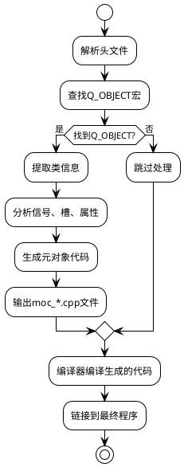
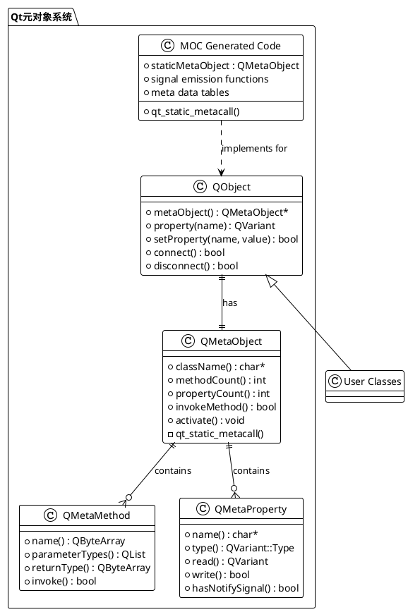
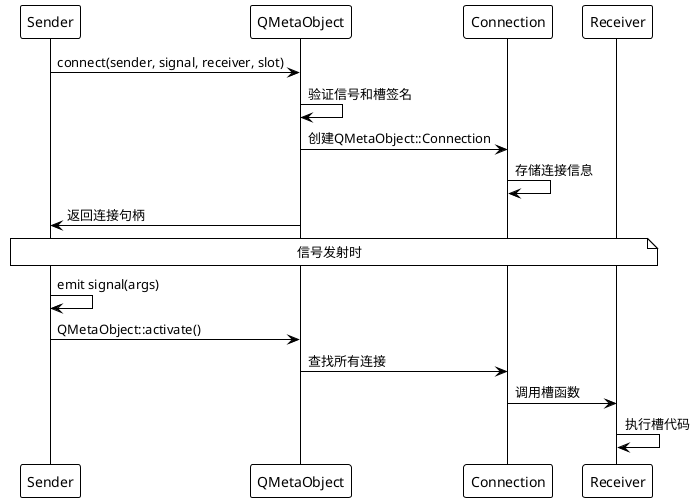

# Qt6 元对象系统深度解析

## 目录
1. [概述](#概述)
2. [核心概念](#核心概念)
3. [QObject基础示例](#qobject基础示例)
4. [MOC编译过程详解](#moc编译过程详解)
5. [元对象系统架构](#元对象系统架构)
6. [信号槽机制深入](#信号槽机制深入)
7. [属性系统](#属性系统)
8. [反射与内省](#反射与内省)
9. [实际应用场景](#实际应用场景)
10. [性能考量](#性能考量)
11. [最佳实践](#最佳实践)

## 概述

Qt的元对象系统（Meta-Object System）是Qt框架的核心基础设施，它为C++语言添加了运行时类型信息、反射能力和动态属性系统。这个系统使得Qt能够提供信号槽机制、属性系统、对象内省等高级特性。

### 为什么需要元对象系统？

C++作为静态类型语言，缺乏运行时类型信息和反射能力。Qt通过元对象系统弥补了这些不足：

- **运行时类型识别**：能够在运行时获取对象的类型信息
- **动态方法调用**：可以通过字符串名称调用方法
- **信号槽机制**：类型安全的观察者模式实现
- **属性系统**：动态属性的读写和监听
- **对象序列化**：自动化的对象持久化

## 核心概念

### QObject - 根基类

所有需要元对象功能的类都必须继承自`QObject`：

```cpp
class QObject {
    Q_OBJECT  // 元对象宏，触发MOC处理
public:
    // 基础功能
    virtual const QMetaObject *metaObject() const;
    static const QMetaObject staticMetaObject;
    
    // 对象树管理
    QObject *parent() const;
    void setParent(QObject *parent);
    QObjectList children() const;
    
    // 属性系统
    QVariant property(const char *name) const;
    bool setProperty(const char *name, const QVariant &value);
    
    // 信号槽
    bool connect(const QObject *sender, const char *signal,
                const QObject *receiver, const char *slot);
};
```

### QMetaObject - 元对象描述符

每个QObject子类都有一个对应的`QMetaObject`实例，包含类的完整元信息：

```cpp
class QMetaObject {
public:
    // 类信息
    const char *className() const;
    const QMetaObject *superClass() const;
    
    // 方法信息
    int methodCount() const;
    QMetaMethod method(int index) const;
    int indexOfMethod(const char *method) const;
    
    // 属性信息
    int propertyCount() const;
    QMetaProperty property(int index) const;
    int indexOfProperty(const char *name) const;
    
    // 动态调用
    bool invokeMethod(QObject *obj, const char *member,
                     QGenericReturnArgument ret,
                     QGenericArgument val0 = QGenericArgument()) const;
};
```

## QObject基础示例

让我们创建一个完整的示例来演示元对象系统的使用：

```cpp
// person.h
#ifndef PERSON_H
#define PERSON_H

#include <QObject>
#include <QString>
#include <QDebug>

class Person : public QObject
{
    Q_OBJECT
    
    // 属性声明
    Q_PROPERTY(QString name READ name WRITE setName NOTIFY nameChanged)
    Q_PROPERTY(int age READ age WRITE setAge NOTIFY ageChanged)
    Q_PROPERTY(bool isAdult READ isAdult STORED false)  // 计算属性，不存储
    
public:
    explicit Person(QObject *parent = nullptr);
    Person(const QString &name, int age, QObject *parent = nullptr);
    
    // 属性访问器
    QString name() const { return m_name; }
    void setName(const QString &name);
    
    int age() const { return m_age; }
    void setAge(int age);
    
    bool isAdult() const { return m_age >= 18; }
    
    // 可调用方法
    Q_INVOKABLE void introduce() const;
    Q_INVOKABLE QString getInfo() const;
    Q_INVOKABLE void celebrateBirthday();

public slots:
    void onNameChanged(const QString &newName);
    void reset();

signals:
    void nameChanged(const QString &newName);
    void ageChanged(int newAge);
    void birthdayCelebrated(int newAge);

private:
    QString m_name;
    int m_age;
};

#endif // PERSON_H
```

```cpp
// person.cpp
#include "person.h"

Person::Person(QObject *parent)
    : QObject(parent), m_name("Unknown"), m_age(0)
{
    // 连接信号槽
    connect(this, &Person::nameChanged, this, &Person::onNameChanged);
}

Person::Person(const QString &name, int age, QObject *parent)
    : QObject(parent), m_name(name), m_age(age)
{
    connect(this, &Person::nameChanged, this, &Person::onNameChanged);
}

void Person::setName(const QString &name)
{
    if (m_name != name) {
        m_name = name;
        emit nameChanged(name);
    }
}

void Person::setAge(int age)
{
    if (m_age != age && age >= 0) {
        m_age = age;
        emit ageChanged(age);
    }
}

void Person::introduce() const
{
    qDebug() << QString("Hello, I'm %1, %2 years old").arg(m_name).arg(m_age);
}

QString Person::getInfo() const
{
    return QString("Name: %1, Age: %2, Adult: %3")
           .arg(m_name)
           .arg(m_age)
           .arg(isAdult() ? "Yes" : "No");
}

void Person::celebrateBirthday()
{
    setAge(m_age + 1);
    qDebug() << m_name << "is now" << m_age << "years old!";
    emit birthdayCelebrated(m_age);
}

void Person::onNameChanged(const QString &newName)
{
    qDebug() << "Name changed to:" << newName;
}

void Person::reset()
{
    setName("Unknown");
    setAge(0);
}

// MOC会生成这个文件的包含
#include "person.moc"
```

## MOC编译过程详解

Meta-Object Compiler (MOC) 是Qt的预处理器，它解析包含`Q_OBJECT`宏的头文件，生成额外的C++代码来实现元对象功能。

### MOC处理流程



### MOC生成的代码分析

当MOC处理我们的`Person`类时，会生成`moc_person.cpp`文件。让我们分析其关键部分：
#### 1. 静态元对象数据

```cpp
// moc_person.cpp (简化版本)

// 字符串表 - 存储所有元信息的字符串
static const uint qt_meta_data_Person[] = {
    // 版本信息
    10,       // revision
    0,        // classname
    0, 0,     // classinfo
    6, 14,    // methods (6个方法，从索引14开始)
    3, 44,    // properties (3个属性，从索引44开始)
    0, 0,     // enums/sets
    0, 0,     // constructors
    0,        // flags
    3,        // signalCount (3个信号)

    // 方法表 (信号 + 槽 + 可调用方法)
    // 信号: nameChanged(QString)
    1, 0x06, 0x80000000 | 2, 3,  // 方法索引1，信号标志，返回类型，参数类型
    // 信号: ageChanged(int)  
    4, 0x06, 0x80000000 | 5, 6,
    // 信号: birthdayCelebrated(int)
    7, 0x06, 0x80000000 | 5, 6,
    // 槽: onNameChanged(QString)
    8, 0x0a, 0x80000000 | 9, 3,
    // 槽: reset()
    10, 0x0a, 0x80000000 | 9, 11,
    // 可调用: introduce()
    12, 0x02, 0x80000000 | 9, 11,

    // 属性表
    // name属性
    13, 0x80000000 | 2, 0x00495103,  // 属性名，类型，标志(READ|WRITE|NOTIFY)
    // age属性  
    14, 0x80000000 | 5, 0x00495103,
    // isAdult属性
    15, 0x01, 0x00095001,  // 只读属性
};

// 字符串数据
static const char qt_meta_stringdata_Person[] = {
    "Person\0"           // 0: 类名
    "nameChanged\0"      // 1: 信号名
    "QString\0"          // 2: 类型名
    "newName\0"          // 3: 参数名
    "ageChanged\0"       // 4
    "int\0"              // 5
    "newAge\0"           // 6
    "birthdayCelebrated\0" // 7
    "onNameChanged\0"    // 8
    "void\0"             // 9
    "reset\0"            // 10
    "\0"                 // 11: 空参数
    "introduce\0"        // 12
    "name\0"             // 13
    "age\0"              // 14
    "isAdult\0"          // 15
};
```

#### 2. QMetaObject实例

```cpp
const QMetaObject Person::staticMetaObject = {
    { &QObject::staticMetaObject,  // 父类元对象
      qt_meta_stringdata_Person,   // 字符串表
      qt_meta_data_Person,         // 数据表
      qt_static_metacall,          // 静态调用函数
      nullptr,                     // 额外数据
      nullptr                      // 不完整类型信息
    }
};

// 虚函数实现
const QMetaObject *Person::metaObject() const
{
    return QObject::d_ptr->metaObject ? 
           QObject::d_ptr->dynamicMetaObject() : 
           &staticMetaObject;
}
```

#### 3. 静态元调用函数

这是元对象系统的核心 - 统一的方法调用接口：

```cpp
void Person::qt_static_metacall(QObject *_o, QMetaObject::Call _c, 
                                int _id, void **_a)
{
    if (_c == QMetaObject::InvokeMetaMethod) {
        auto *_t = static_cast<Person *>(_o);
        Q_UNUSED(_t)
        switch (_id) {
        case 0: _t->nameChanged((*reinterpret_cast<QString*>(_a[1]))); break;
        case 1: _t->ageChanged((*reinterpret_cast<int*>(_a[1]))); break;
        case 2: _t->birthdayCelebrated((*reinterpret_cast<int*>(_a[1]))); break;
        case 3: _t->onNameChanged((*reinterpret_cast<QString*>(_a[1]))); break;
        case 4: _t->reset(); break;
        case 5: _t->introduce(); break;
        default: ;
        }
    } else if (_c == QMetaObject::ReadProperty) {
        auto *_t = static_cast<Person *>(_o);
        Q_UNUSED(_t)
        void *_v = _a[0];
        switch (_id) {
        case 0: *reinterpret_cast<QString*>(_v) = _t->name(); break;
        case 1: *reinterpret_cast<int*>(_v) = _t->age(); break;
        case 2: *reinterpret_cast<bool*>(_v) = _t->isAdult(); break;
        default: break;
        }
    } else if (_c == QMetaObject::WriteProperty) {
        auto *_t = static_cast<Person *>(_o);
        Q_UNUSED(_t)
        void *_v = _a[0];
        switch (_id) {
        case 0: _t->setName(*reinterpret_cast<QString*>(_v)); break;
        case 1: _t->setAge(*reinterpret_cast<int*>(_v)); break;
        default: break;
        }
    }
}
```

#### 4. 信号发射函数

MOC为每个信号生成发射函数：

```cpp
// 信号发射函数
void Person::nameChanged(const QString & _t1)
{
    void *_a[] = { nullptr, const_cast<void*>(reinterpret_cast<const void*>(&_t1)) };
    QMetaObject::activate(this, &staticMetaObject, 0, _a);
}

void Person::ageChanged(int _t1)
{
    void *_a[] = { nullptr, const_cast<void*>(reinterpret_cast<const void*>(&_t1)) };
    QMetaObject::activate(this, &staticMetaObject, 1, _a);
}

void Person::birthdayCelebrated(int _t1)
{
    void *_a[] = { nullptr, const_cast<void*>(reinterpret_cast<const void*>(&_t1)) };
    QMetaObject::activate(this, &staticMetaObject, 2, _a);
}
```

## 元对象系统架构

### 整体架构图



### 类关系详解

1. **QObject**: 所有元对象功能的基类
2. **QMetaObject**: 类的元信息容器
3. **QMetaMethod**: 方法的元信息封装
4. **QMetaProperty**: 属性的元信息封装
5. **MOC Generated Code**: 编译时生成的实现代码

## 信号槽机制深入

信号槽是Qt最著名的特性，基于元对象系统实现类型安全的观察者模式。

### 连接机制

```cpp
// 使用示例
Person *person = new Person("Alice", 25);
QObject::connect(person, &Person::nameChanged, 
                [](const QString &name) {
                    qDebug() << "Name changed to:" << name;
                });

// 等价的字符串连接方式
QObject::connect(person, SIGNAL(nameChanged(QString)),
                this, SLOT(onPersonNameChanged(QString)));
```

### 连接过程分析



### 信号发射的内部实现

```cpp
// QMetaObject::activate的简化实现
void QMetaObject::activate(QObject *sender, const QMetaObject *m, 
                          int local_signal_index, void **argv)
{
    // 获取信号的全局索引
    int signal_index = local_signal_index + m->methodOffset();
    
    // 查找所有连接到此信号的槽
    QObjectPrivate::ConnectionList *list = 
        sender->d_func()->connectionLists;
    
    if (list && list[signal_index].first) {
        QObjectPrivate::Connection *c = list[signal_index].first;
        
        do {
            QObject *receiver = c->receiver;
            if (receiver) {
                // 调用槽函数
                if (c->callFunction) {
                    // 函数指针调用
                    c->callFunction(receiver, QMetaObject::InvokeMetaMethod, 
                                   c->method_relative, argv);
                } else {
                    // 通过元对象调用
                    receiver->metaObject()->metacall(
                        receiver, QMetaObject::InvokeMetaMethod, 
                        c->method(), argv);
                }
            }
            c = c->nextConnectionList;
        } while (c);
    }
}
```

## 属性系统

Qt的属性系统提供了统一的属性访问接口，支持运行时读写和变更通知。

### 属性声明语法

```cpp
class MyWidget : public QWidget
{
    Q_OBJECT
    
    // 基本属性
    Q_PROPERTY(QString title READ title WRITE setTitle NOTIFY titleChanged)
    
    // 只读属性
    Q_PROPERTY(int count READ count)
    
    // 带默认值的属性
    Q_PROPERTY(bool enabled READ isEnabled WRITE setEnabled)
    
    // 枚举属性
    Q_PROPERTY(Qt::Alignment alignment READ alignment WRITE setAlignment)
    
    // 计算属性（不存储）
    Q_PROPERTY(QString displayText READ displayText STORED false)
    
    // 可重置属性
    Q_PROPERTY(QColor color READ color WRITE setColor RESET resetColor)
    
    // 用户属性（设计器中可见）
    Q_PROPERTY(QString userText READ userText WRITE setUserText USER true)

public:
    // 属性访问器实现...
    QString title() const { return m_title; }
    void setTitle(const QString &title) {
        if (m_title != title) {
            m_title = title;
            emit titleChanged(title);
        }
    }

signals:
    void titleChanged(const QString &title);

private:
    QString m_title;
};
```

### 动态属性访问

```cpp
// 使用示例
MyWidget *widget = new MyWidget;

// 通过属性系统访问
widget->setProperty("title", "Hello Qt");
QString title = widget->property("title").toString();

// 动态属性（运行时添加）
widget->setProperty("customData", QVariant::fromValue(someData));

// 属性枚举
const QMetaObject *metaObj = widget->metaObject();
for (int i = 0; i < metaObj->propertyCount(); ++i) {
    QMetaProperty prop = metaObj->property(i);
    qDebug() << "Property:" << prop.name() 
             << "Type:" << prop.typeName()
             << "Value:" << prop.read(widget);
}
```

## 反射与内省

元对象系统提供了强大的反射能力，允许在运行时检查和操作对象。

### 类型信息获取

```cpp
void analyzeObject(QObject *obj)
{
    const QMetaObject *metaObj = obj->metaObject();
    
    qDebug() << "Class:" << metaObj->className();
    qDebug() << "Inherits QObject:" << obj->inherits("QObject");
    
    // 遍历继承层次
    const QMetaObject *current = metaObj;
    while (current) {
        qDebug() << "  Inherits:" << current->className();
        current = current->superClass();
    }
    
    // 方法信息
    qDebug() << "Methods:";
    for (int i = 0; i < metaObj->methodCount(); ++i) {
        QMetaMethod method = metaObj->method(i);
        qDebug() << "  " << method.methodSignature()
                 << "Type:" << method.methodType()
                 << "Access:" << method.access();
    }
    
    // 属性信息
    qDebug() << "Properties:";
    for (int i = 0; i < metaObj->propertyCount(); ++i) {
        QMetaProperty prop = metaObj->property(i);
        qDebug() << "  " << prop.name() 
                 << "(" << prop.typeName() << ")"
                 << "Readable:" << prop.isReadable()
                 << "Writable:" << prop.isWritable();
    }
}
```

### 动态方法调用

```cpp
// 通过字符串调用方法
bool invokeMethodByName(QObject *obj, const QString &methodName, 
                       const QVariantList &args = QVariantList())
{
    const QMetaObject *metaObj = obj->metaObject();
    
    // 构建方法签名
    QString signature = methodName + "(";
    for (int i = 0; i < args.size(); ++i) {
        if (i > 0) signature += ",";
        signature += args[i].typeName();
    }
    signature += ")";
    
    // 查找方法
    int methodIndex = metaObj->indexOfMethod(signature.toLatin1());
    if (methodIndex == -1) {
        qWarning() << "Method not found:" << signature;
        return false;
    }
    
    QMetaMethod method = metaObj->method(methodIndex);
    
    // 准备参数
    QGenericArgument genericArgs[10];
    for (int i = 0; i < qMin(args.size(), 10); ++i) {
        genericArgs[i] = QGenericArgument(args[i].typeName(), 
                                         args[i].constData());
    }
    
    // 调用方法
    return method.invoke(obj, 
                        genericArgs[0], genericArgs[1], genericArgs[2],
                        genericArgs[3], genericArgs[4], genericArgs[5],
                        genericArgs[6], genericArgs[7], genericArgs[8],
                        genericArgs[9]);
}

// 使用示例
Person *person = new Person("Bob", 30);
QVariantList args;
args << QString("Charlie");
invokeMethodByName(person, "setName", args);
```

## 实际应用场景

### 1. 插件系统

```cpp
class PluginInterface
{
public:
    virtual ~PluginInterface() = default;
    virtual QString pluginName() const = 0;
    virtual void execute() = 0;
};

Q_DECLARE_INTERFACE(PluginInterface, "com.example.PluginInterface/1.0")

class MyPlugin : public QObject, public PluginInterface
{
    Q_OBJECT
    Q_INTERFACES(PluginInterface)
    Q_PLUGIN_METADATA(IID "com.example.PluginInterface" FILE "plugin.json")
    
public:
    QString pluginName() const override { return "MyPlugin"; }
    void execute() override { /* 插件逻辑 */ }
};

// 插件加载
QPluginLoader loader("myplugin.dll");
QObject *plugin = loader.instance();
if (plugin) {
    PluginInterface *interface = qobject_cast<PluginInterface*>(plugin);
    if (interface) {
        interface->execute();
    }
}
```

### 2. 序列化系统

```cpp
class Serializer
{
public:
    static QJsonObject serialize(QObject *obj)
    {
        QJsonObject json;
        const QMetaObject *metaObj = obj->metaObject();
        
        json["className"] = metaObj->className();
        
        QJsonObject properties;
        for (int i = 0; i < metaObj->propertyCount(); ++i) {
            QMetaProperty prop = metaObj->property(i);
            if (prop.isStored()) {
                QVariant value = prop.read(obj);
                properties[prop.name()] = QJsonValue::fromVariant(value);
            }
        }
        json["properties"] = properties;
        
        return json;
    }
    
    static bool deserialize(QObject *obj, const QJsonObject &json)
    {
        if (json["className"].toString() != obj->metaObject()->className()) {
            return false;
        }
        
        QJsonObject properties = json["properties"].toObject();
        for (auto it = properties.begin(); it != properties.end(); ++it) {
            obj->setProperty(it.key().toLatin1(), it.value().toVariant());
        }
        
        return true;
    }
};
```

### 3. 数据绑定系统

```cpp
class DataBinding : public QObject
{
    Q_OBJECT
    
public:
    static void bind(QObject *source, const QString &sourceProp,
                    QObject *target, const QString &targetProp)
    {
        // 初始同步
        QVariant value = source->property(sourceProp.toLatin1());
        target->setProperty(targetProp.toLatin1(), value);
        
        // 设置变更监听
        const QMetaObject *metaObj = source->metaObject();
        int propIndex = metaObj->indexOfProperty(sourceProp.toLatin1());
        if (propIndex != -1) {
            QMetaProperty prop = metaObj->property(propIndex);
            if (prop.hasNotifySignal()) {
                QMetaMethod signal = prop.notifySignal();
                QMetaMethod slot = target->metaObject()->method(
                    target->metaObject()->indexOfSlot("updateProperty()"));
                
                QObject::connect(source, signal, target, slot);
            }
        }
    }
};
```

## 性能考量

### 1. 编译时开销

- MOC增加编译时间
- 生成额外的源代码文件
- 增加可执行文件大小

### 2. 运行时开销

```cpp
// 性能测试示例
void performanceTest()
{
    Person *person = new Person("Test", 25);
    
    // 直接调用 vs 元对象调用
    QElapsedTimer timer;
    
    // 直接调用（最快）
    timer.start();
    for (int i = 0; i < 1000000; ++i) {
        person->setName("Direct");
    }
    qDebug() << "Direct call:" << timer.elapsed() << "ms";
    
    // 属性系统调用（较慢）
    timer.restart();
    for (int i = 0; i < 1000000; ++i) {
        person->setProperty("name", "Property");
    }
    qDebug() << "Property call:" << timer.elapsed() << "ms";
    
    // 反射调用（最慢）
    timer.restart();
    for (int i = 0; i < 1000000; ++i) {
        QMetaObject::invokeMethod(person, "setName", 
                                 Q_ARG(QString, "Reflection"));
    }
    qDebug() << "Reflection call:" << timer.elapsed() << "ms";
}
```

### 3. 优化建议

1. **避免频繁的反射调用**：在性能关键路径上使用直接调用
2. **缓存元对象信息**：避免重复查找方法和属性
3. **合理使用信号槽**：避免过度连接和深层嵌套
4. **属性系统优化**：对于简单类型，考虑直接访问

## 最佳实践

### 1. 类设计原则

```cpp
class WellDesignedClass : public QObject
{
    Q_OBJECT
    
    // 属性应该有明确的语义
    Q_PROPERTY(QString title READ title WRITE setTitle NOTIFY titleChanged)
    Q_PROPERTY(bool enabled READ isEnabled WRITE setEnabled)
    
public:
    explicit WellDesignedClass(QObject *parent = nullptr);
    
    // 提供类型安全的信号槽连接
    QString title() const { return m_title; }
    void setTitle(const QString &title);
    
    bool isEnabled() const { return m_enabled; }
    void setEnabled(bool enabled);
    
    // 使用Q_INVOKABLE标记可从外部调用的方法
    Q_INVOKABLE void performAction();

public slots:
    // 槽函数应该是幂等的
    void reset();
    void refresh();

signals:
    // 信号名称应该描述发生的事件
    void titleChanged(const QString &newTitle);
    void enabledChanged(bool enabled);
    void actionPerformed();

private:
    QString m_title;
    bool m_enabled = true;
    
    // 避免在信号发射中进行复杂操作
    void emitTitleChanged();
};
```

### 2. 信号槽最佳实践

```cpp
// 好的做法
connect(sender, &Sender::dataReady, 
        receiver, &Receiver::processData, 
        Qt::QueuedConnection);  // 明确指定连接类型

// 避免的做法
connect(sender, SIGNAL(dataReady()), 
        receiver, SLOT(processData()));  // 字符串连接，无编译时检查

// 使用lambda时注意对象生命周期
connect(sender, &Sender::finished, [this, sender]() {
    // 确保this和sender仍然有效
    if (sender && !sender->isDestroyed()) {
        handleFinished();
    }
});
```

### 3. 属性系统最佳实践

```cpp
class PropertyExample : public QObject
{
    Q_OBJECT
    
    // 为复杂属性提供重置功能
    Q_PROPERTY(QColor backgroundColor 
               READ backgroundColor 
               WRITE setBackgroundColor 
               RESET resetBackgroundColor 
               NOTIFY backgroundColorChanged)
    
    // 计算属性不应该有副作用
    Q_PROPERTY(QString displayText READ displayText STORED false)
    
public:
    QColor backgroundColor() const { return m_backgroundColor; }
    void setBackgroundColor(const QColor &color) {
        if (m_backgroundColor != color) {
            m_backgroundColor = color;
            emit backgroundColorChanged(color);
            // 触发相关计算属性的更新通知
            emit displayTextChanged();
        }
    }
    
    void resetBackgroundColor() {
        setBackgroundColor(QColor(Qt::white));
    }
    
    QString displayText() const {
        return QString("Background: %1").arg(m_backgroundColor.name());
    }

signals:
    void backgroundColorChanged(const QColor &color);
    void displayTextChanged();

private:
    QColor m_backgroundColor = Qt::white;
};
```

## 实践项目

本文档配套了一个完整的Qt6 CMake演示项目，位于同一目录下。项目包含：

### 项目文件结构
```
├── CMakeLists.txt                    # CMake构建配置，支持自动MOC处理
├── README.md                         # 项目使用说明
├── src/
│   ├── main.cpp                      # 演示程序入口
│   ├── person.h/.cpp                 # Person类 - 基础元对象演示
│   ├── company.h/.cpp                # Company类 - 复杂元对象演示  
│   ├── demo_runner.h/.cpp            # 演示控制器
│   └── generated/                    # MOC生成文件目录
│       ├── moc_person.cpp            # Person类MOC生成代码
│       ├── moc_company.cpp           # Company类MOC生成代码
│       └── moc_person_analyzed.cpp   # 带详细中文注释的MOC分析
└── build/                            # 构建输出目录
```

### 快速开始
```bash
# 编译项目
mkdir build && cd build
cmake ..
cmake --build .

# 运行演示
./bin/Qt6MetaObjectDemo

# 查看MOC生成的代码
ls -la src/generated/
```

### 演示内容
1. **基础信号槽机制** - 属性变化、方法调用、事件响应
2. **属性系统使用** - 动态属性、计算属性、属性绑定
3. **反射和内省** - 类信息获取、方法枚举、动态调用
4. **复杂对象交互** - 对象组合、信号槽网络、生命周期管理
5. **性能测试对比** - 直接调用 vs 属性系统 vs 反射调用
6. **MOC代码分析** - 详细解释生成代码的结构和作用

### 学习价值
- **理论结合实践**：通过可运行的代码理解抽象概念
- **MOC代码解析**：深入了解元对象系统的内部实现
- **性能基准测试**：了解不同调用方式的性能差异
- **最佳实践示例**：学习正确的元对象系统使用方法

## 总结

Qt的元对象系统是一个精心设计的运行时类型系统，它为C++添加了反射、信号槽、属性系统等高级特性。通过MOC预处理器，Qt在编译时生成必要的元信息和辅助代码，实现了高效的运行时特性。

理解元对象系统的关键点：

1. **QObject是基础**：所有需要元对象功能的类都必须继承QObject
2. **MOC是桥梁**：连接声明式的元信息和运行时的实现
3. **性能有代价**：反射调用比直接调用慢，需要权衡使用
4. **类型安全**：现代Qt推荐使用函数指针而非字符串连接
5. **生命周期管理**：注意对象的生命周期，特别是在异步操作中

通过理论学习和实践项目的结合，你将能够：
- 深入理解Qt元对象系统的设计原理和实现机制
- 熟练掌握信号槽、属性系统、反射等核心特性的使用
- 了解MOC编译器生成代码的结构和工作方式
- 在实际项目中合理选择和优化元对象系统的使用
- 为进一步学习Qt的高级特性打下坚实基础

掌握元对象系统将帮助你更好地理解Qt的工作原理，编写更优雅和高效的Qt应用程序。